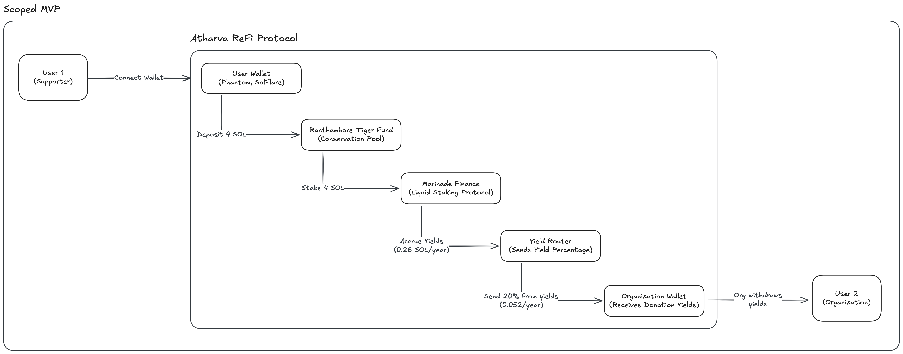
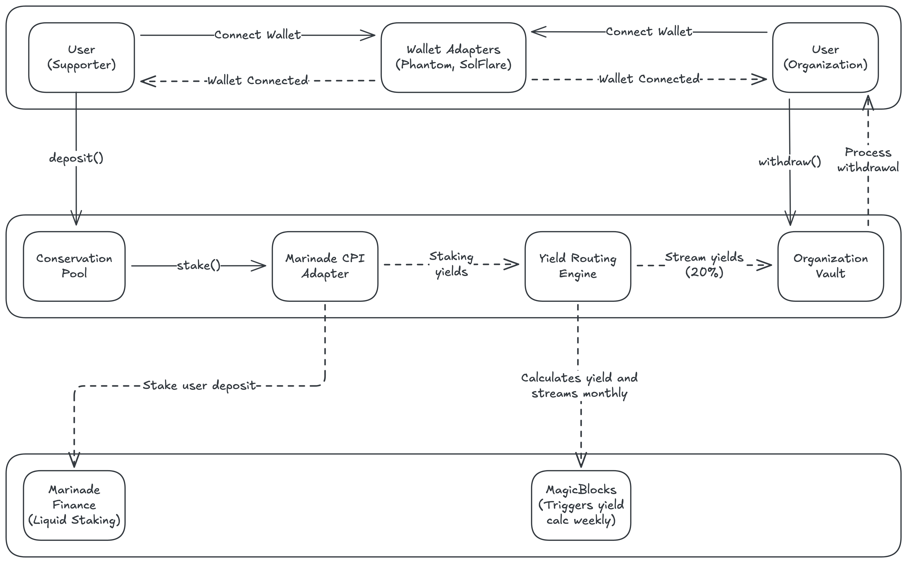

## Atharva ReFi Protocol

Atharva ReFi Protocol merges conservation with Solana, using Regenerative Finance to make protection of real-world endangered species come alive on the blockchain through transparent, incentivized impact.

### User Story

You can view the User Story document [here](./docs/USER-STORY.md)

### Architecture Diagrams

#### 1. Scoped

#### 2. Detailed

### Possible Bugs

- ADMIN_PUBKEY is in code, what if an attacker decides to change it to theirs?
- Make sure species is lowercase to avoid errors
- Implement checks for all inputs and avoid duplication