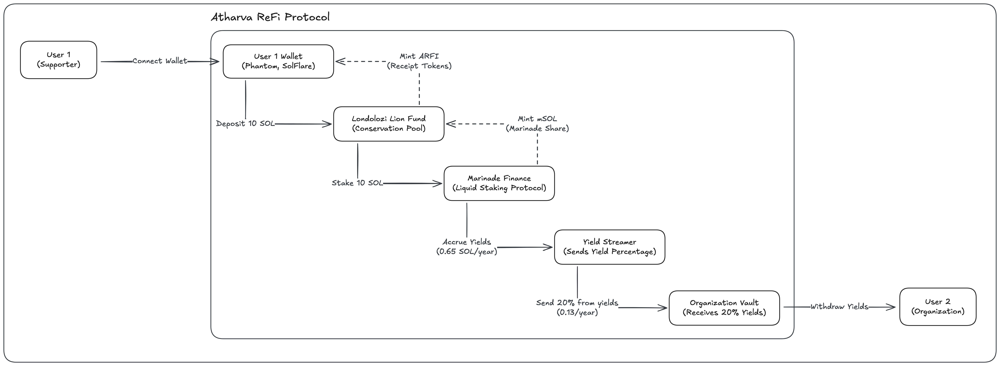
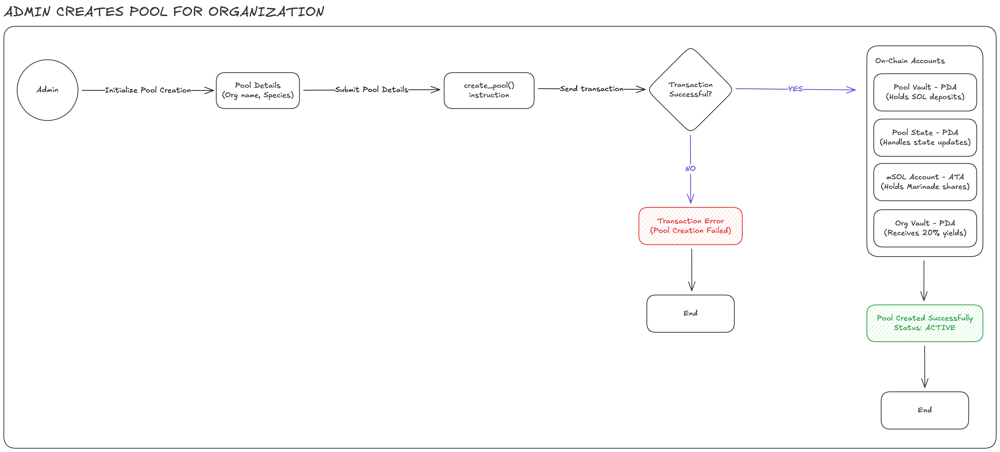
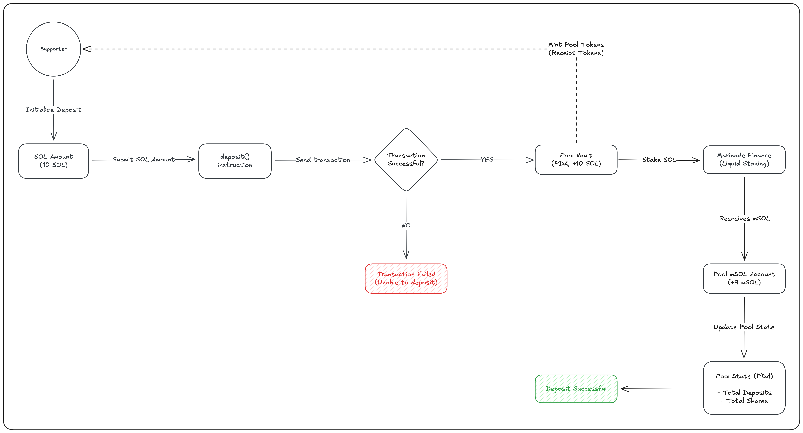
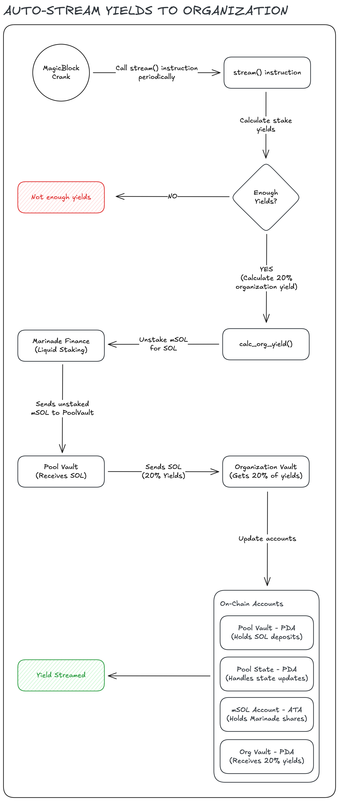

## Atharva ReFi Protocol

Atharva ReFi Protocol merges conservation with Solana, using Regenerative Finance to make protection of real-world endangered species come alive on the blockchain through transparent, incentivized impact.

### User Story

You can view the User Story document [here](./docs/USER-STORY.md)

### Architecture Diagrams



#### 2. Detailed





### Possible Bugs

- ADMIN_PUBKEY is in code, what if an attacker decides to change it to theirs?
- Make sure species is lowercase to avoid errors
- Implement checks for all inputs and avoid duplication
- Is it not better to update any state before transactions to prevent reentrancy?
- Make sure orgs can only withdraw to the wallet they submitted during pool creation to prevent fraud.
- Add validation constraints to accounts e.g: #[account(
  mut,
  constraint = pool_msol_account.mint == msol_mint.key() @ ErrorCode::InvalidMsolAccount,
  constraint = pool_msol_account.owner == pool_vault.key() @ ErrorCode::InvalidMsolAccount,
  )]
  pub pool_msol_account: InterfaceAccount<'info, TokenAccount>,
- Switch to using TokenInterface for marinade accounts (uncertain but worth a shot)

# Constraints

- (address = marinade_finance::STATE @ ErrorCode::InvalidMarinadeState),
- token::mint = msol_mint, token::authority = pool_vault,

### To Do

- Slippage protection

### Possible Useful Notes

- shares / total_shares = supporter's % ownership
- supporter's mSOL = total_pool_mSOL \* (shares / total_shares)

This automatically includes the 80% yield because:

- Pool's mSOL balance grows over time (staking rewards)
- 20% is regularly streamed out via `stream_yields`
- 80% stays in pool, increasing mSOL value
- Supporters get proportional share of remaining mSOL

### **2. Withdrawal Flow**

```
1. Calculate: shares → mSOL amount
2. Unstake: mSOL → SOL (via Marinade)
3. Transfer: SOL → supporter
4. Burn: share tokens
5. Update: pool state
```

Run - ./dump_marinade.sh - to dump all marinade accounts from mainnet

Dump program - solana program dump -u m MarBmsSgKXdrN1egZf5sqe1TMai9K1rChYNDJgjq7aD marinade.so
Dump account - solana account -u m 8szGkuLTAux9XMgZ2vtY39jVSowEcpBfFfD8hXSEqdGC --output json > marinade_state.json
